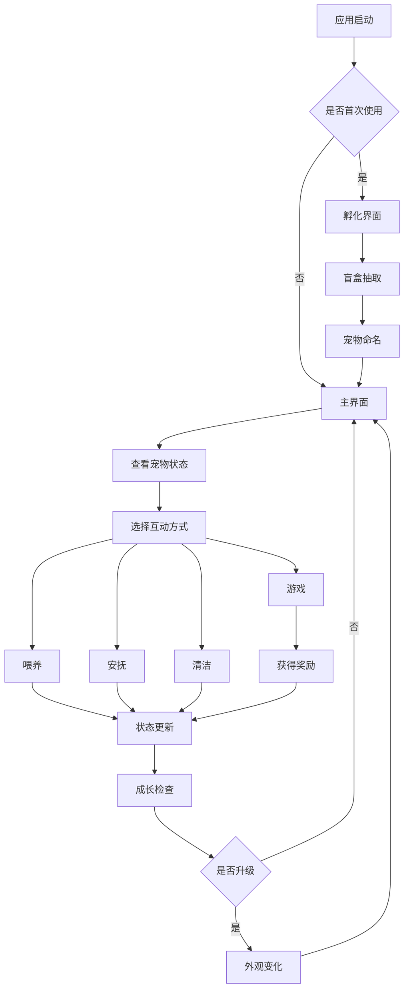

# 像素电子宠物模拟应用产品需求文档

## 1. Product Overview

本产品是一款怀旧风格的像素电子宠物模拟应用，重现2000年代便携式电子宠物设备的经典体验。用户通过盲盒孵化获得随机宠物，体验完整的宠物养成过程，包括喂养、互动、游戏和成长。

产品旨在为现代用户提供轻松愉快的休闲养成体验，通过精心设计的时间机制和成长系统，让用户在碎片化时间中享受陪伴宠物的乐趣。目标市场为怀旧游戏爱好者和休闲养成游戏用户群体。

## 2. Core Features

### 2.1 User Roles

本应用采用单一用户角色设计，无需复杂的权限区分：

| Role | Registration Method | Core Permissions |
|------|---------------------|------------------|
| 宠物主人 | 直接进入应用 | 可孵化宠物、进行所有互动操作、访问全部功能 |

### 2.2 Feature Module

我们的像素电子宠物应用包含以下主要页面：

1. **主界面**：宠物展示区域、状态指示器、快捷操作按钮
2. **孵化界面**：盲盒抽取、宠物命名、稀有度展示
3. **互动界面**：喂养选项、安抚动作、亲密度显示
4. **游戏中心**：迷你游戏列表、游戏入口、奖励展示
5. **成长记录**：宠物档案、成长历程、数值统计
6. **设置界面**：时间设置、通知管理、数据备份

### 2.3 Page Details

| Page Name | Module Name | Feature description |
|-----------|-------------|---------------------|
| 主界面 | 宠物展示区 | 显示当前宠物的像素动画、根据状态播放不同动作、支持点击互动 |
| 主界面 | 状态面板 | 实时显示饥饿度、心情值、清洁度的可视化进度条和数值 |
| 主界面 | 快捷按钮 | 提供喂养、清洁、游戏等常用功能的一键访问入口 |
| 孵化界面 | 盲盒系统 | 随机生成宠物种类，按稀有度概率分配（水豚1%，其他各19.8%） |
| 孵化界面 | 命名功能 | 允许用户为新孵化的宠物输入自定义名称，支持中英文字符 |
| 孵化界面 | 稀有度展示 | 显示获得宠物的稀有度等级和特殊效果说明 |
| 互动界面 | 喂养系统 | 提供干粮（定时补充）和零食（游戏奖励）两种食物选择 |
| 互动界面 | 安抚动作 | 基础触摸互动（每日10次限制）和抱抱动作（需达到亲密度要求） |
| 互动界面 | 亲密度显示 | 展示当前亲密度等级和解锁的特殊互动方式 |
| 游戏中心 | 迷你游戏 | 包含3-5种简单易玩的像素风格小游戏，如记忆配对、反应测试等 |
| 游戏中心 | 奖励机制 | 根据游戏表现给予零食奖励，影响宠物成长数值 |
| 成长记录 | 宠物档案 | 记录宠物基本信息、年龄、成长阶段和重要里程碑 |
| 成长记录 | 外观变化 | 展示宠物在不同成长阶段的像素外观对比 |
| 成长记录 | 数值统计 | 显示历史数值变化曲线和照顾质量评分 |
| 设置界面 | 时间管理 | 设置通知提醒、查看离线时间计算结果 |
| 设置界面 | 数据管理 | 本地数据备份、恢复功能，支持云端同步（可选） |

## 3. Core Process

### 主要用户操作流程

**初次使用流程：**
用户首次打开应用 → 进入孵化界面 → 点击盲盒进行抽取 → 获得随机宠物 → 为宠物命名 → 进入主界面开始养成

**日常养成流程：**
打开应用查看宠物状态 → 根据需要进行喂养或清洁 → 进行触摸互动增加亲密度 → 参与迷你游戏获取奖励 → 观察宠物成长变化

**离线重返流程：**
重新打开应用 → 系统计算离线时间 → 显示宠物状态变化 → 处理可能的紧急状况（如饥饿、生病） → 恢复正常互动

## 4. User Interface Design

### 4.1 Design Style

**色彩方案：**
- 主色调：温暖的米白色 (#F5F5DC) 作为背景
- 辅助色：柔和的薄荷绿 (#98FB98) 用于按钮和强调元素
- 状态色：红色 (#FF6B6B) 表示饥饿，蓝色 (#4ECDC4) 表示清洁，黄色 (#FFE66D) 表示心情

**视觉风格：**
- 按钮样式：圆角矩形设计，带有轻微阴影效果，点击时有像素化按压动画
- 字体设计：使用像素风格字体，主要文字12px，标题16px，确保清晰可读
- 布局风格：采用卡片式布局，顶部导航栏，主要内容区域居中显示
- 图标风格：8-bit像素风格图标，使用简洁的线条和明亮的色彩

### 4.2 Page Design Overview

| Page Name | Module Name | UI Elements |
|-----------|-------------|-------------|
| 主界面 | 宠物展示区 | 中央320x240像素显示区域，深色边框模拟经典电子宠物屏幕，宠物精灵采用16x16像素规格 |
| 主界面 | 状态面板 | 三个水平进度条，使用渐变色彩，左侧图标右侧数值，整体高度40px |
| 主界面 | 操作按钮 | 底部四个圆形按钮，直径48px，使用Material Design阴影效果 |
| 孵化界面 | 盲盒动画 | 中央蛋形图标，点击时播放破壳动画，使用帧动画实现，总时长2秒 |
| 孵化界面 | 稀有度特效 | 根据稀有度显示不同颜色的光效，普通白光，稀有金光，传说彩虹光 |
| 互动界面 | 食物选择 | 网格布局展示食物图标，每个48x48像素，带有数量标识和效果说明 |
| 游戏中心 | 游戏卡片 | 卡片式布局，每张卡片160x120像素，包含游戏截图和难度星级 |
| 成长记录 | 时间轴 | 垂直时间轴设计，左侧时间点，右侧成长事件，使用连接线串联 |

### 4.3 Responsiveness

本应用采用移动端优先设计，主要针对手机屏幕优化，支持竖屏和横屏两种模式。界面元素支持触摸操作，按钮和互动区域最小尺寸为44x44像素以确保良好的触摸体验。考虑到像素风格的特殊性，不进行复杂的响应式缩放，而是采用固定像素比例在不同屏幕上居中显示。