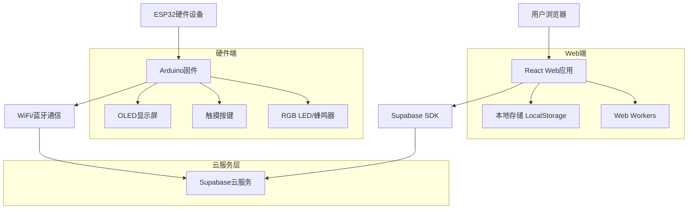
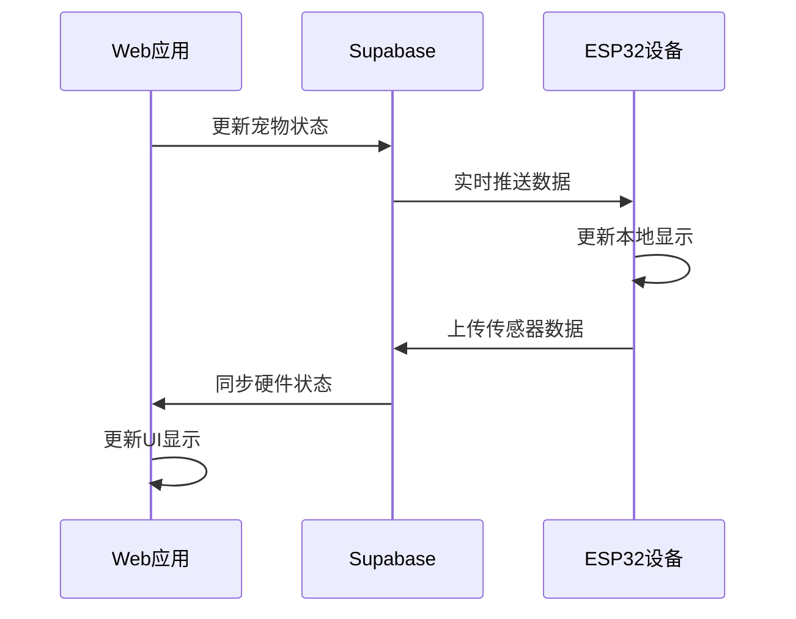
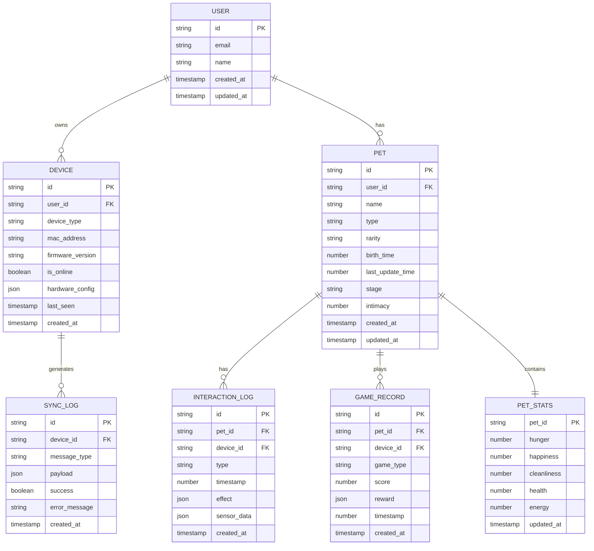

# 像素电子宠物模拟应用技术架构文档

## 1. Architecture design

### 1.1 跨平台整体架构



### 1.2 数据同步架构



## 2. Technology Description

### 2.1 Web端技术栈
- Frontend: React@18 + TypeScript + Vite + TailwindCSS + Framer Motion
- 状态管理: Zustand
- 像素图形: HTML5 Canvas + 自定义像素渲染引擎
- 本地存储: LocalStorage + IndexedDB
- 时间计算: Web Workers (后台时间处理)
- 实时通信: Supabase Realtime

### 2.2 ESP32硬件端技术栈
- 主控芯片: ESP32-WROOM-32D (WiFi/蓝牙双模)
- 开发框架: Arduino Core for ESP32
- 编程语言: C++ (兼容Arduino语法)
- 开发工具: PlatformIO + VS Code
- 图形库: U8g2 (OLED显示驱动)
- 通信协议: WiFi (HTTP/WebSocket) + BLE
- 传感器接口: I2C/GPIO
- 低功耗: ESP32深度睡眠模式

### 2.3 云服务层
- Backend: Supabase (认证、数据库、实时同步)
- 数据库: PostgreSQL (Supabase托管)
- 实时同步: Supabase Realtime Subscriptions
- 文件存储: Supabase Storage
- 认证服务: Supabase Auth

## 3. Route definitions

### 3.1 Web端路由

| Route | Purpose |
|-------|----------|
| / | 主界面，显示宠物状态和基本互动功能 |
| /hatch | 孵化界面，盲盒抽取和宠物命名 |
| /interact | 互动界面，喂养、安抚等详细互动选项 |
| /games | 游戏中心，迷你游戏列表和入口 |
| /games/:gameId | 具体游戏界面，运行选定的迷你游戏 |
| /profile | 成长记录，宠物档案和历史数据 |
| /settings | 设置界面，通知、备份等系统设置 |
| /device | 硬件设备管理，配对和同步设置 |

### 3.2 ESP32硬件端状态机

| State | Purpose |
|-------|----------|
| BOOT | 系统启动，初始化硬件和网络连接 |
| IDLE | 待机状态，显示宠物基本信息 |
| INTERACT | 交互模式，响应触摸按键操作 |
| SYNC | 数据同步，与云端服务通信 |
| SLEEP | 深度睡眠，低功耗待机模式 |
| UPDATE | OTA更新，固件无线升级 |

## 4. API definitions

### 4.1 跨平台数据接口

**设备注册与认证**
```typescript
// 设备信息
interface DeviceInfo {
  deviceId: string;
  deviceType: 'web' | 'esp32';
  macAddress?: string;
  firmwareVersion?: string;
  lastSeen: number;
  isOnline: boolean;
}

// 设备配对
interface DevicePairing {
  pairingCode: string;
  deviceInfo: DeviceInfo;
  expiresAt: number;
}
```

**实时数据同步**
```typescript
// 同步消息格式
interface SyncMessage {
  messageId: string;
  deviceId: string;
  timestamp: number;
  type: 'pet_update' | 'interaction' | 'game_result' | 'status_sync';
  payload: any;
}

// 硬件状态上报
interface HardwareStatus {
  batteryLevel: number;
  temperature: number;
  lastInteraction: number;
  buttonPressed?: string;
  motionDetected?: boolean;
}
```

### 4.2 Web端API

**宠物数据管理**
```typescript
// 宠物基础信息
interface Pet {
  id: string;
  name: string;
  type: 'dog' | 'cat' | 'panda' | 'dinosaur' | 'rabbit' | 'capybara';
  rarity: 'common' | 'rare' | 'legendary';
  birthTime: number;
  lastUpdateTime: number;
  stage: 'baby' | 'adult' | 'elder';
  stats: PetStats;
  intimacy: number;
}

// 宠物状态数值
interface PetStats {
  hunger: number;      // 饥饿度 0-100
  happiness: number;   // 心情值 0-100
  cleanliness: number; // 清洁度 0-100
  health: number;      // 健康值 0-100
  energy: number;      // 精力值 0-100
}

// 互动记录
interface InteractionLog {
  id: string;
  petId: string;
  type: 'feed' | 'touch' | 'hug' | 'clean' | 'play';
  timestamp: number;
  effect: Partial<PetStats>;
}

// 游戏记录
interface GameRecord {
  id: string;
  petId: string;
  gameType: string;
  score: number;
  reward: GameReward;
  timestamp: number;
}

interface GameReward {
  food?: number;
  happiness?: number;
  intimacy?: number;
}
```

**本地存储API**
```typescript
// 宠物数据操作
class PetStorage {
  static savePet(pet: Pet): void;
  static loadPet(): Pet | null;
  static updatePetStats(stats: Partial<PetStats>): void;
  static addInteractionLog(log: InteractionLog): void;
  static getInteractionHistory(limit?: number): InteractionLog[];
}

// 游戏数据操作
class GameStorage {
  static saveGameRecord(record: GameRecord): void;
  static getGameRecords(gameType?: string): GameRecord[];
  static getBestScore(gameType: string): number;
}

// 设置数据操作
class SettingsStorage {
  static saveSettings(settings: AppSettings): void;
  static loadSettings(): AppSettings;
}

interface AppSettings {
  notifications: boolean;
  soundEnabled: boolean;
  autoSave: boolean;
  theme: 'classic' | 'modern';
}
```

**时间计算API**
```typescript
// 离线时间计算
class TimeCalculator {
  static calculateOfflineEffects(lastUpdateTime: number): OfflineEffects;
  static getPetAge(birthTime: number): number;
  static getLifeStage(age: number): 'baby' | 'adult' | 'elder';
  static shouldEvolve(pet: Pet): boolean;
}

interface OfflineEffects {
  hungerDecrease: number;
  happinessDecrease: number;
  cleanlinessDecrease: number;
  ageIncrease: number;
  evolutionTriggered: boolean;
}
```

### 4.3 ESP32硬件端API

**硬件通信协议 (C++)**
```cpp
// 设备配置结构
struct DeviceConfig {
  char deviceId[32];
  char wifiSSID[32];
  char wifiPassword[64];
  char supabaseUrl[128];
  char supabaseKey[256];
  bool bleEnabled;
  int sleepInterval;
};

// 宠物状态结构
struct PetStatusHW {
  int hunger;
  int happiness;
  int cleanliness;
  int health;
  int energy;
  long lastUpdate;
  char stage[16];
};

// 硬件交互事件
struct InteractionEvent {
  char type[16];        // "touch", "button1", "button2", "motion"
  long timestamp;
  int intensity;        // 触摸强度或按键时长
  float sensorData[4];  // 传感器数据数组
};
```

**核心硬件函数**
```cpp
class PetHardware {
public:
  // 系统初始化
  static bool initializeDevice();
  static bool connectWiFi();
  static bool syncWithCloud();
  
  // 显示控制
  static void updateDisplay(PetStatusHW* status);
  static void showAnimation(const char* animType);
  static void displayMessage(const char* message);
  
  // 交互处理
  static InteractionEvent readInput();
  static void handleTouch(int touchPin);
  static void playFeedback(const char* feedbackType);
  
  // 数据同步
  static bool uploadStatus(PetStatusHW* status);
  static bool downloadUpdates();
  static void enterSleepMode(int duration);
};
```

## 5. Data model

### 5.1 Data model definition



### 5.2 Data Definition Language

**用户表 (users)**
```sql
-- 创建用户表
CREATE TABLE users (
    id UUID PRIMARY KEY DEFAULT gen_random_uuid(),
    email VARCHAR(255) UNIQUE NOT NULL,
    name VARCHAR(100) NOT NULL,
    created_at TIMESTAMP WITH TIME ZONE DEFAULT NOW(),
    updated_at TIMESTAMP WITH TIME ZONE DEFAULT NOW()
);

-- 创建设备表
CREATE TABLE devices (
    id UUID PRIMARY KEY DEFAULT gen_random_uuid(),
    user_id UUID NOT NULL REFERENCES users(id) ON DELETE CASCADE,
    device_type VARCHAR(20) NOT NULL CHECK (device_type IN ('web', 'esp32')),
    mac_address VARCHAR(17) UNIQUE,
    firmware_version VARCHAR(20),
    is_online BOOLEAN DEFAULT false,
    hardware_config JSONB DEFAULT '{}',
    last_seen TIMESTAMP WITH TIME ZONE DEFAULT NOW(),
    created_at TIMESTAMP WITH TIME ZONE DEFAULT NOW()
);

-- 创建宠物表
CREATE TABLE pets (
    id UUID PRIMARY KEY DEFAULT gen_random_uuid(),
    user_id UUID NOT NULL REFERENCES users(id) ON DELETE CASCADE,
    name VARCHAR(50) NOT NULL,
    type VARCHAR(20) NOT NULL CHECK (type IN ('dog', 'cat', 'panda', 'dinosaur', 'rabbit', 'capybara')),
    rarity VARCHAR(20) NOT NULL CHECK (rarity IN ('common', 'rare', 'legendary')),
    birth_time BIGINT NOT NULL,
    last_update_time BIGINT NOT NULL,
    stage VARCHAR(20) NOT NULL CHECK (stage IN ('baby', 'adult', 'elder')),
    intimacy INTEGER DEFAULT 0 CHECK (intimacy >= 0 AND intimacy <= 100),
    created_at TIMESTAMP WITH TIME ZONE DEFAULT NOW(),
    updated_at TIMESTAMP WITH TIME ZONE DEFAULT NOW()
);

-- 创建宠物状态表
CREATE TABLE pet_stats (
    pet_id UUID PRIMARY KEY REFERENCES pets(id) ON DELETE CASCADE,
    hunger INTEGER DEFAULT 100 CHECK (hunger >= 0 AND hunger <= 100),
    happiness INTEGER DEFAULT 100 CHECK (happiness >= 0 AND happiness <= 100),
    cleanliness INTEGER DEFAULT 100 CHECK (cleanliness >= 0 AND cleanliness <= 100),
    health INTEGER DEFAULT 100 CHECK (health >= 0 AND health <= 100),
    energy INTEGER DEFAULT 100 CHECK (energy >= 0 AND energy <= 100),
    updated_at TIMESTAMP WITH TIME ZONE DEFAULT NOW()
);

-- 创建互动记录表
CREATE TABLE interaction_logs (
    id UUID PRIMARY KEY DEFAULT gen_random_uuid(),
    pet_id UUID NOT NULL REFERENCES pets(id) ON DELETE CASCADE,
    device_id UUID REFERENCES devices(id) ON DELETE SET NULL,
    type VARCHAR(20) NOT NULL CHECK (type IN ('feed', 'touch', 'hug', 'clean', 'play')),
    timestamp BIGINT NOT NULL,
    effect JSONB NOT NULL,
    sensor_data JSONB DEFAULT '{}',
    created_at TIMESTAMP WITH TIME ZONE DEFAULT NOW()
);

-- 创建游戏记录表
CREATE TABLE game_records (
    id UUID PRIMARY KEY DEFAULT gen_random_uuid(),
    pet_id UUID NOT NULL REFERENCES pets(id) ON DELETE CASCADE,
    device_id UUID REFERENCES devices(id) ON DELETE SET NULL,
    game_type VARCHAR(50) NOT NULL,
    score INTEGER NOT NULL DEFAULT 0,
    reward JSONB NOT NULL,
    timestamp BIGINT NOT NULL,
    created_at TIMESTAMP WITH TIME ZONE DEFAULT NOW()
);

-- 创建同步日志表
CREATE TABLE sync_logs (
    id UUID PRIMARY KEY DEFAULT gen_random_uuid(),
    device_id UUID NOT NULL REFERENCES devices(id) ON DELETE CASCADE,
    message_type VARCHAR(50) NOT NULL,
    payload JSONB NOT NULL,
    success BOOLEAN DEFAULT true,
    error_message TEXT,
    created_at TIMESTAMP WITH TIME ZONE DEFAULT NOW()
);

-- 创建索引
CREATE INDEX idx_users_email ON users(email);
CREATE INDEX idx_devices_user_id ON devices(user_id);
CREATE INDEX idx_devices_type ON devices(device_type);
CREATE INDEX idx_devices_mac_address ON devices(mac_address);
CREATE INDEX idx_devices_last_seen ON devices(last_seen DESC);
CREATE INDEX idx_pets_user_id ON pets(user_id);
CREATE INDEX idx_pets_type ON pets(type);
CREATE INDEX idx_pets_rarity ON pets(rarity);
CREATE INDEX idx_interaction_logs_pet_id ON interaction_logs(pet_id);
CREATE INDEX idx_interaction_logs_device_id ON interaction_logs(device_id);
CREATE INDEX idx_interaction_logs_timestamp ON interaction_logs(timestamp DESC);
CREATE INDEX idx_game_records_pet_id ON game_records(pet_id);
CREATE INDEX idx_game_records_device_id ON game_records(device_id);
CREATE INDEX idx_game_records_game_type ON game_records(game_type);
CREATE INDEX idx_game_records_score ON game_records(score DESC);
CREATE INDEX idx_sync_logs_device_id ON sync_logs(device_id);
CREATE INDEX idx_sync_logs_message_type ON sync_logs(message_type);
CREATE INDEX idx_sync_logs_created_at ON sync_logs(created_at DESC);

-- 设置权限
GRANT SELECT ON users TO anon;
GRANT SELECT ON devices TO anon;
GRANT SELECT ON pets TO anon;
GRANT SELECT ON pet_stats TO anon;
GRANT ALL PRIVILEGES ON users TO authenticated;
GRANT ALL PRIVILEGES ON devices TO authenticated;
GRANT ALL PRIVILEGES ON pets TO authenticated;
GRANT ALL PRIVILEGES ON pet_stats TO authenticated;
GRANT ALL PRIVILEGES ON interaction_logs TO authenticated;
GRANT ALL PRIVILEGES ON game_records TO authenticated;
GRANT ALL PRIVILEGES ON sync_logs TO authenticated;

-- 初始化数据
INSERT INTO pets (name, type, rarity, birth_time, last_update_time, stage) VALUES
('示例小狗', 'dog', 'common', extract(epoch from now()) * 1000, extract(epoch from now()) * 1000, 'baby'),
('示例小猫', 'cat', 'common', extract(epoch from now()) * 1000, extract(epoch from now()) * 1000, 'baby');

INSERT INTO pet_stats (pet_id, hunger, happiness, cleanliness, health, energy)
SELECT id, 80, 90, 85, 95, 75 FROM pets WHERE name IN ('示例小狗', '示例小猫');
```

## 6. ESP32硬件开发配置

### 6.1 开发环境搭建

**PlatformIO配置文件 (platformio.ini)**
```ini
[env:esp32dev]
platform = espressif32
board = esp32dev
framework = arduino
monitor_speed = 115200

; 核心库依赖
lib_deps = 
    olikraus/U8g2@^2.34.22          ; OLED显示库
    bblanchon/ArduinoJson@^6.21.3   ; JSON处理
    arduino-libraries/WiFi@^1.2.7   ; WiFi连接
    knolleary/PubSubClient@^2.8     ; MQTT客户端
    adafruit/Adafruit MPU6050@^2.2.4 ; 加速度计(可选)

; 编译选项
build_flags = 
    -DCORE_DEBUG_LEVEL=3
    -DBOARD_HAS_PSRAM
    -DARDUINO_USB_CDC_ON_BOOT=1

; 上传配置
upload_speed = 921600
monitor_filters = esp32_exception_decoder
```

### 6.2 硬件引脚配置

```cpp
// 硬件引脚定义
#define OLED_SDA_PIN    21    // OLED数据线
#define OLED_SCL_PIN    22    // OLED时钟线
#define TOUCH_PIN_1     4     // 触摸按键1
#define TOUCH_PIN_2     2     // 触摸按键2
#define RGB_LED_PIN     5     // RGB LED数据线
#define BUZZER_PIN      18    // 蜂鸣器
#define BATTERY_PIN     36    // 电池电压检测
#define MPU6050_SDA     21    // 加速度计数据线(与OLED共用)
#define MPU6050_SCL     22    // 加速度计时钟线(与OLED共用)

// 系统配置
#define WIFI_TIMEOUT    10000 // WiFi连接超时(ms)
#define SYNC_INTERVAL   30000 // 数据同步间隔(ms)
#define SLEEP_DURATION  300   // 深度睡眠时长(秒)
#define TOUCH_THRESHOLD 40    // 触摸灵敏度阈值
```

### 6.3 核心功能实现

**设备初始化流程**
```cpp
void setup() {
  Serial.begin(115200);
  
  // 初始化硬件
  initializeDisplay();
  initializeTouchSensors();
  initializeRGBLED();
  initializeBuzzer();
  
  // 连接WiFi
  connectToWiFi();
  
  // 从云端同步数据
  syncPetData();
  
  // 显示启动画面
  showBootAnimation();
}

void loop() {
  // 检查触摸输入
  handleTouchInput();
  
  // 更新显示
  updatePetDisplay();
  
  // 定期同步数据
  if (millis() - lastSyncTime > SYNC_INTERVAL) {
    syncWithCloud();
    lastSyncTime = millis();
  }
  
  // 检查是否需要进入睡眠模式
  checkSleepCondition();
  
  delay(100);
}
```

## 7. 核心算法设计

### 7.1 时间模拟算法

```typescript
// 时间转换：现实1小时 = 宠物世界1天
const REAL_HOUR_TO_PET_DAY = 60 * 60 * 1000; // 1小时的毫秒数

class TimeSimulation {
  // 计算宠物年龄（以天为单位）
  static calculatePetAge(birthTime: number): number {
    const currentTime = Date.now();
    const ageInMs = currentTime - birthTime;
    return Math.floor(ageInMs / REAL_HOUR_TO_PET_DAY);
  }
  
  // 计算离线期间状态衰减
  static calculateStatDecay(offlineHours: number): Partial<PetStats> {
    const hungerDecay = Math.min(offlineHours * 5, 50); // 每小时饥饿度-5
    const happinessDecay = Math.min(offlineHours * 3, 30); // 每小时心情-3
    const cleanlinessDecay = Math.min(offlineHours * 2, 20); // 每小时清洁度-2
    
    return {
      hunger: -hungerDecay,
      happiness: -happinessDecay,
      cleanliness: -cleanlinessDecay
    };
  }
}
```

### 7.2 稀有度抽取算法

```typescript
class RaritySystem {
  private static readonly RARITY_WEIGHTS = {
    capybara: 1,    // 1% 水豚
    dog: 19.8,      // 19.8% 小狗
    cat: 19.8,      // 19.8% 小猫
    panda: 19.8,    // 19.8% 小熊猫
    dinosaur: 19.8, // 19.8% 小恐龙
    rabbit: 19.8    // 19.8% 小兔子
  };
  
  static hatchRandomPet(): { type: string; rarity: string } {
    const random = Math.random() * 100;
    let cumulative = 0;
    
    for (const [type, weight] of Object.entries(this.RARITY_WEIGHTS)) {
      cumulative += weight;
      if (random <= cumulative) {
        const rarity = type === 'capybara' ? 'legendary' : 'common';
        return { type, rarity };
      }
    }
    
    return { type: 'dog', rarity: 'common' }; // 默认返回
  }
}
```

## 8. 部署和开发指南

### 8.1 Web端部署
1. 安装依赖：`npm install`
2. 配置Supabase环境变量
3. 构建项目：`npm run build`
4. 部署到Vercel/Netlify等平台

### 8.2 ESP32固件开发
1. 安装PlatformIO扩展
2. 配置硬件连接
3. 修改WiFi和API配置
4. 编译并上传固件：`pio run -t upload`

### 8.3 设备配对流程
1. ESP32生成配对码并显示在OLED屏幕
2. 用户在Web应用中输入配对码
3. 系统验证并建立设备关联
4. 开始实时数据同步